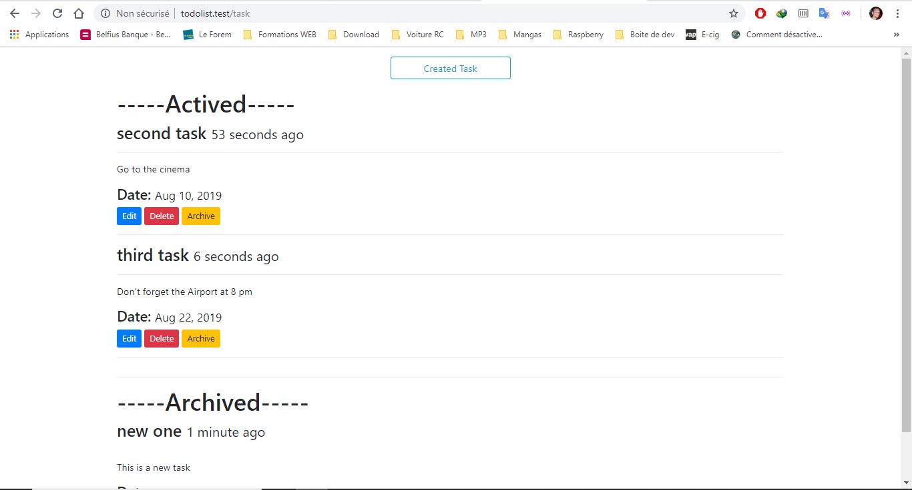
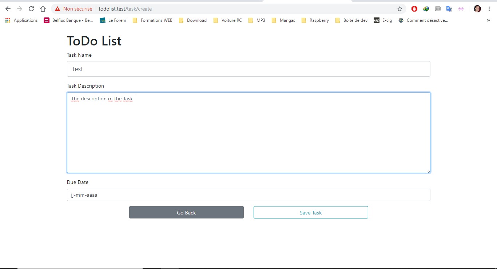

# ToDo List PHP Laravel

## Création d'une Todolist en php avec le Framework Laravel

--- 

## Les langages et outils utilisés 

* HTML5
* CSS3
* PHP
* Laravel
---

## Quand a t-il été réalisé ? 

Ce projet a été réalisé le 30 Aout 2019.

## Dans quel cadre ce projet a vu le jour ?

Il s'agit d'un travail réalisé dans le cadre de la formation BeCode.

--- 

## Présentation du code

<p>Dans cette partie, je vais vous présenter le code qui a été réalisé pour le projet. </p>

### Partie PHP
<details>
<summary>Fichier Controller</summary>

```markdown
<?php

namespace App\Http\Controllers;

use App\Models\Task;
use Illuminate\Http\Request;
use Illuminate\Support\Facades\Session;

class TaskController extends Controller
{
    /**
     * Display a listing of the resource.
     *
     * @return \Illuminate\Http\Response
     */
    public function index()
    {
        $tasks = Task::where('archive', false )->orderBy('due_date', 'asc')->paginate(5);
        $archive = Task::where('archive', true )->orderBy('due_date', 'asc')->paginate(5);

        return view('tasks.index', compact('archive', 'tasks'));
    }

    public function archive($id, $state)
    {
        Task::findOrFail($id)->update(['archive'=> $state]);
        return back();
    }


    /**
     * Show the form for creating a new resource.
     *
     * @return \Illuminate\Http\Response
     */
    public function create()
    {
        return view('tasks.create');
    }

    /**
     * Store a newly created resource in storage.
     *
     * @param  \Illuminate\Http\Request  $request
     * @return \Illuminate\Http\Response
     */
    public function store(Request $request)
    {
        // validate the data
        $this->validate ($request, [
            'name' =>'required|string|max:255|min:3',
            'description' => 'required|string|max:10000|min:10',
            'due_date' => 'required|date',
        ]);

        // create a new task
        $task = new Task;

        // Assign a task data from our request
        $task->name = $request->name;
        $task->description = $request->description;
        $task->due_date = $request->due_date;

        // save the task
        $task->save();

        // Flash Session Message with success
        Session::flash('success', 'Created Task Successfully');

        // Return a redirect
        return redirect()->route('task.index');

    }

    /**
     * Display the specified resource.
     *
     * @param  int  $id
     * @return \Illuminate\Http\Response
     */
    public function show($id)
    {
        //
    }

    /**
     * Show the form for editing the specified resource.
     *
     * @param  int  $id
     * @return \Illuminate\Http\Response
     */
    public function edit($id)
    {
        $task = Task::find($id);
        $task->dueDateFormatting = false;
        return view('tasks.edit')->withTask($task);
    }

    /**
     * Update the specified resource in storage.
     *
     * @param  \Illuminate\Http\Request  $request
     * @param  int  $id
     * @return \Illuminate\Http\Response
     */
    public function update(Request $request, $id)
    {
            // validate the data
            $this->validate ($request, [
                'name' =>'required|string|max:255|min:3',
                'description' => 'required|string|max:10000|min:10',
                'due_date' => 'required|date',
            ]);
    
            // find a task
            $task = Task::find($id);
    
            // Assign a task data from our request
            $task->name = $request->name;
            $task->description = $request->description;
            $task->due_date = $request->due_date;
    
            // save the task
            $task->save();
    
            // Flash Session Message with success
            Session::flash('success', 'Saved The Task Successfully');
    
            // Return a redirect
            return redirect()->route('task.index');
    
        }
    

    /**
     * Remove the specified resource from storage.
     *
     * @param  int  $id
     * @return \Illuminate\Http\Response
     */

     public function destroy($id)
     {
         $task = Task::find($id);

         $task->delete();

         Session::flash('success', 'Delete the task success');

         return redirect()->route('task.index');


     }
    }

```
</details>

<details>
<summary>Fichier Tasks</summary>

```markdown

@extends ('layouts.main')

@section ('title', 'Tasks Home')

@section ('content')
          
    <div class="row justify-content-center mb-3">
        <div class="col-sm-4 text-center">
            <a href="{{ route('task.create') }}" class="btn btn-outline-info" style="width: 200px">Created Task</a>
        </div>
    </div>

    <h1>-----Actived-----</h1>

    @if($tasks->count() == 0)
        <p class="lead text-center">No Task ToDo !!</p>
    @else
        @foreach($tasks as $task)
            <div class="row">
                <div class="col-sm-12">
                <h3>
                    {{ $task->name}}
                    <small>{{ $task->created_at }}</small>
                </h3>
                <hr>
                <p>{{ $task->description}}</p>
                <h4>Date: <small>{{ $task->due_date}}</small></h4>
                
                {!! Form::open(['route' => ['task.destroy', $task->id], 'method' => 'DELETE']) !!}
                    <a href="{{ route ('task.edit', $task->id)}}" class="btn btn-sm btn-primary">Edit</a>
                    <button type="submit" class="btn btn-sm btn-danger">Delete</button>
                    <a href="{{ route('tasks.archive', ['id'=>$task->id,'state'=> 1])}}" class="btn btn-sm btn-warning">Archive</a>
                {!! Form::close() !!}
                </div>
            </div>
            <hr>
        @endforeach

        <div class="row justify-content-center">
            <div class="col-sm6 text-center">
                {{ $tasks->links() }}
            </div>
        </div>
    @endif

    <hr>
    <h1>-----Archived-----</h1>

    @if($archive->count() == 0)
        <p class="lead text-center">No Task ToDo !!</p>
    @else
        @foreach($archive as $task)
            <div class="row">
                <div class="col-sm-12">
                <h3>
                    {{ $task->name}}
                    <small>{{ $task->created_at }}</small>
                </h3>
                <hr>
                <p>{{ $task->description}}</p>
                <h4>Date: <small>{{ $task->due_date}}</small></h4>
                
                {!! Form::open(['route' => ['task.destroy', $task->id], 'method' => 'DELETE']) !!}
                    <a href="{{ route ('task.edit', $task->id)}}" class="btn btn-sm btn-primary">Edit</a>
                    <button type="submit" class="btn btn-sm btn-danger">Delete</button>
                    <a href="{{ route('tasks.archive', ['id' => $task->id, 'state' => 0])}}" class="btn btn-sm btn-warning">Back</a>
                {!! Form::close() !!}
                </div>
            </div>
            <hr>
        @endforeach
    @endif

@endsection


```
</details>

## Le résultat en image :





